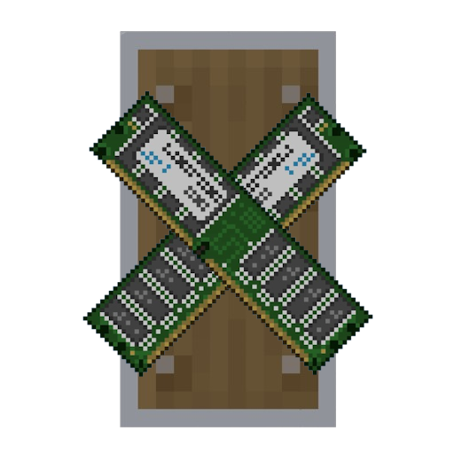

  

# RamGuard

Have you ever had players complain about crashes or low frame rates only to discover that they were using your 250+ mod pack with 2 GB of RAM? RamGuard detects this immediately upon launch. It saves you from repeatedly responding to troubleshooting questions by reading the memory allotted before the main menu loads and alerting the player if additional memory is needed.

## Highlights
* Set suggested and minimum RAM constraints (in megabytes).
* complete control on button actions, colors and UI Text.
* Placeholders and Autoformats
* There’s an option to strictly require enough RAM before players are allowed to access the menu.
* has a button for an external link that will take users directly to your setup instructions.

## KEY FEATURES
* **Configurable Limits:** Set the minimum required and recommended thresholds for RAM in megabytes.
* **Full UI Control:** Setup every header, text line, color and button action straight from configuration.
* **memory placeholders:** automatically format memory values ​​with `%MB%` and `%GB%`.
* **Forced crash:** Optionally require sufficient RAM for players to access the main menu (forceCrashOnLowRam = true).
* **Direct Setup Guide:** An interactive button that takes the players directly to your launcher setup tutorial.

## Setup
When you first start it a ramguard.cfg file will be created in your config/ directory.
Feel free to use the `%MB%` and `%GB%` placeholders in the text fields to dynamically inject memory values into your custom warnings.

## Installation
Drop the compiled `.jar` file into your `mods/` folder. It is safe to include in server modpacks as it is marked as a client-side only mod.

## Credits
Created by Rener.
